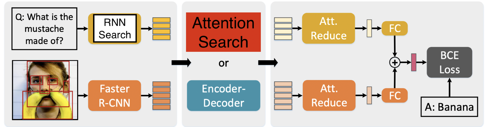

# Pytorch implementation for attempt Neural Architecture Search on Visual Question Answering task

#### *Description*: This repository exists for legacy reason

If you make use of this code, please cite the following information [and star me (0.0)]
```
@{Dang_2020_NAS_Attempt
author = {Dang, Anh-Chuong}
title = {Attempt Neural Architecture Search on Visual Question Answering task},
month = {May},
year = {2020}
publisher = {GitHub}
journal = {GitHub repository}
commit = {master}
}
```

## Abstract
This repository contains Pytorch implementation for my attempt NAS on Vision Language models (VQA task).
In this work, I utilized MCAN-VQA model and factorized its operations then applied Search algorithms i.e SNAS to optimize Network's architecture.<br/>

For more detais, plz refer to my code as well as summary report [`summary.pdf`](./summary.pdf).

## Prerequisites

#### Dependencies

You should install some necessary packages.

1. Install [Python](https://www.python.org/downloads/) >= 3.5
2. Install [Cuda](https://developer.nvidia.com/cuda-toolkit) >= 9.0 and [cuDNN](https://developer.nvidia.com/cudnn)
3. Install [PyTorch](http://pytorch.org/) >= 1.x with CUDA.
4. Install [SpaCy](https://spacy.io/) and initialize the [GloVe](https://github.com/explosion/spacy-models/releases/download/en_vectors_web_lg-2.1.0/en_vectors_web_lg-2.1.0.tar.gz) as follows:

	```bash
	$ pip install -r requirements.txt
	$ wget https://github.com/explosion/spacy-models/releases/download/en_vectors_web_lg-2.1.0/en_vectors_web_lg-2.1.0.tar.gz -O en_vectors_web_lg-2.1.0.tar.gz
	$ pip install en_vectors_web_lg-2.1.0.tar.gz
	```


#### Setup

 The image features are extracted using the [bottom-up-attention](https://github.com/peteanderson80/bottom-up-attention) strategy, with each image being represented as an dynamic number (from 10 to 100) of 2048-D features. We store the features for each image in a `.npz` file. You can prepare the visual features by yourself or download the extracted features from [OneDrive](https://awma1-my.sharepoint.com/:f:/g/personal/yuz_l0_tn/EsfBlbmK1QZFhCOFpr4c5HUBzUV0aH2h1McnPG1jWAxytQ?e=2BZl8O) or [BaiduYun](https://pan.baidu.com/s/1C7jIWgM3hFPv-YXJexItgw#list/path=%2F). The downloaded files contains three files: **train2014.tar.gz, val2014.tar.gz, and test2015.tar.gz**, corresponding to the features of the train/val/test images for *VQA-v2*, respectively.<br/>
For more details of setup: Please refer to repository (https://github.com/MILVLG/mcan-vqa)

## Training
For search stage, run file `run_search.py`. Command for running search:
```
python run_search.py --RUN=str --GPU=str --SEED=int --PRELOAD=bool
```

+ After you achieved desired architecture, please copy it to namedtuple ```VQAGenotype``` in ```genotypes.py``` file in ```model``` folder.

For evaluation stage, run file `run.py`. Command for running evaluation:
```
python run.py --RUN=str --ARCH_NAME=str --GPU=str --SEED=int --PRELOAD=bool
```

where;<br/>
`str`: should be replaced with string element of your choices. e.g. For `--RUN` of option choices are `{'train', 'val'}`<br/>
`int`: a integer element of your choices<br/>
`bool`: boolean element, i.e. `True` or `False`<br/>

## Progression
The project was under progression. However, around the end of April 2020,  A great work, which has quite similar approach with more favorable results, was published hence unfortunately I decided to stop this project.<br/>
Published paper (mentioned above): [Deep Multimodal Neural Architecture Search](https://arxiv.org/abs/2004.12070)<br/>
As for personal curiosity, any further suggestions, advices are welcome.

## Implementation References
https://github.com/MILVLG/mcan-vqa<br/>
https://github.com/cvlab-tohoku/Dense-CoAttention-Network<br/>
